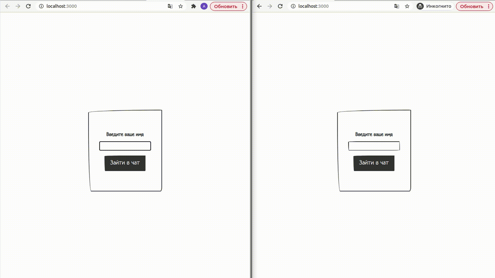

# Chat on socket.io, express, react, mongoose

# Для старта

git clone git@github.com:belooki/socket-io-chat.git // In your folder

cd // your folder

cd client

npm install

cd ../server

npm install

npm start

cd ../client

npm start

# О приложении

Простая реализация чата с помощью библиотеки socket.io
Пользователь вводит имя и попадает в общую комнату, где может обмениваться сообщениями в рабочей сети.
Сессии полььзователя сохраняются в базу данных.
